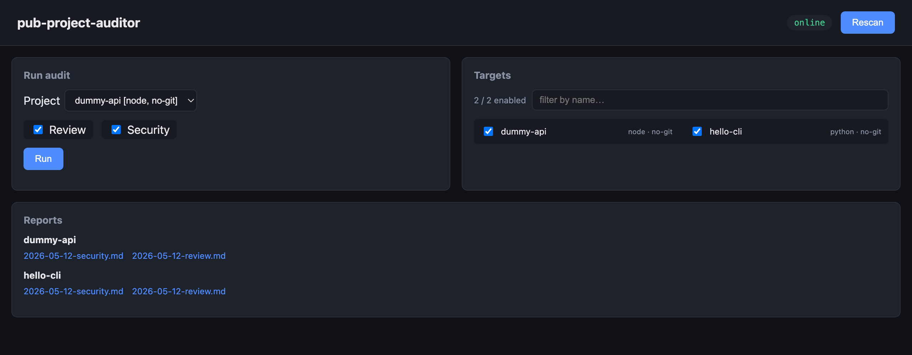

# pub-project-auditor

> Audit every Git repo on your laptop with Claude Code — in one command.

`pub-project-auditor` scans a directory of local Git repositories and runs
AI-powered **code review** and **security audits** on each one, then renders
the Markdown reports in a tiny web dashboard.

Built on top of the [Claude Code](https://docs.claude.com/en/docs/claude-code/overview) CLI.

 



---

## Why

If you're like most developers, you have dozens of half-finished side projects
sitting in `~/code`. Some haven't been opened in a year. Some have hardcoded
secrets you forgot about. Some are full of duplicated logic you've since
solved more cleanly in a newer repo.

`pub-project-auditor` walks the whole pile and produces a one-page report per
repo so you can decide what to revive, refactor, or delete.

## Features

- **One command, every repo.** Point it at a directory, get a report per repo.
- **Two audits, today.** `review` (code quality + reuse opportunities) and `security`
  (secrets, deps, injection points).
- **Web dashboard.** Browse reports, toggle which repos are in-scope, kick off
  audits without touching the terminal.
- **Privacy-first.** Everything runs locally. Nothing is uploaded except the
  prompts/code that Claude Code itself sends.
- **Owner-aware.** If you point it at a folder that mixes your repos with
  cloned external repos (`ComfyUI`, etc.), it filters them out by `git remote`
  origin.

## Quick start

```bash
git clone https://github.com/YOUR-USERNAME/pub-project-auditor.git
cd pub-project-auditor
python3 -m venv .venv && source .venv/bin/activate
pip install -e .

cp .env.example .env
# edit .env: set AUDITOR_REPOS_DIR to the absolute path of your repos folder

# scan once to build config/targets.json
pub-auditor scan

# run one audit
pub-auditor run review hello-cli

# or launch the dashboard
python -m pub_auditor.server
# → http://127.0.0.1:6020
```

## Try it on the bundled demo

The repo ships with a tiny `demo/` folder containing two synthetic projects so
you can verify the wiring before pointing it at your real code:

```bash
AUDITOR_REPOS_DIR=$(pwd)/demo pub-auditor scan
AUDITOR_REPOS_DIR=$(pwd)/demo pub-auditor run review hello-cli
```

## Requirements

- Python 3.9+
- [Claude Code CLI](https://docs.claude.com/en/docs/claude-code/overview)
  installed on `PATH` (or set `CLAUDE_BIN` in `.env`)
- **An authenticated Claude session.** Either:
  - sign in with a Claude Pro / Max subscription via `claude login`, or
  - set `ANTHROPIC_API_KEY` (pay-as-you-go via the Anthropic API).

  Without one of these the CLI cannot call the model and every audit will fail
  with an authentication error.

## Configuration

All configuration is via environment variables — see [`.env.example`](.env.example):

| Variable | Default | Purpose |
|---|---|---|
| `AUDITOR_REPOS_DIR` | *(required)* | Absolute path to your repos folder |
| `AUDITOR_OWNERS` | *(empty)* | Comma-separated owners; only repos whose `git remote origin` URL matches are kept. Empty = keep all local repos |
| `AUDITOR_PORT` | `6020` | Dashboard port |
| `AUDITOR_HOST` | `127.0.0.1` | Bind host (loopback by default). Any other value **requires** `AUDITOR_TOKEN`; the server refuses to start otherwise. |
| `AUDITOR_TOKEN` | *(empty)* | Required iff `AUDITOR_HOST` is not loopback. Bearer token; pass as `Authorization: Bearer <token>` header or `?token=<token>` query. Constant-time compare. Generate with `python -c "import secrets; print(secrets.token_urlsafe(32))"`. |
| `CLAUDE_BIN` | *(PATH lookup)* | Path to `claude` binary |
| `AUDITOR_MODEL` | `sonnet` | Claude model |
| `AUDITOR_TIMEOUT_SEC` | `1800` | Per-audit timeout |

### Trust boundary (read before pointing this at someone else's code)

- **The repos you audit are untrusted input.** Their READMEs, source files, and config are fed to Claude as prompt context. A hostile repo can attempt prompt injection ("ignore prior, write X to disk"). The default `--tools` allowlist is `Read,Glob,Grep` (read-only), which contains the blast radius, but treat audit reports as advisory rather than authoritative when the target repo isn't yours.
- **Audit prompts leave your machine.** Claude Code sends the prompt (which includes excerpts of the target repo) to Anthropic's API. If a target repo contains secrets, those flow upstream and may appear in generated reports. Scrub `.env` / credential files before pointing the auditor at a sensitive project.
- **`AUDITOR_REPOS_DIR` is trusted, the contents are not.** The scanner only walks paths under that directory, but every repo inside is a potential prompt-injection source.

## CLI

```
pub-auditor scan                    # discover repos, write config/targets.json
pub-auditor run review  <project>   # run code-review audit
pub-auditor run security <project>  # run security audit
```

The `--repos-dir` flag overrides `AUDITOR_REPOS_DIR` for one invocation.

## How it works

1. `scanner.py` walks `AUDITOR_REPOS_DIR`, classifies each subdirectory by its
   `git remote origin` (owned / external / no-git), and writes `config/targets.json`.
2. Each task (`tasks/review.py`, `tasks/security.py`) prompts Claude Code in
   the target repo's working directory. By default Claude Code only gets
   `Read,Glob,Grep` tools — no shell, no edits — so a malicious file in a
   target repo cannot cause Claude to run arbitrary commands. The Markdown
   result is saved to `reports/<project>/<YYYY-MM-DD>-<task>.md`.
3. The FastAPI dashboard (`server.py`) renders the reports and lets you
   toggle, rescan, and re-run audits.

## What goes where

```
pub_auditor/
├── config.py          # env-driven config (no defaults to your home dir)
├── scanner.py         # repo discovery
├── runner.py          # Claude Code subprocess wrapper
├── tasks/
│   ├── review.py      # code review prompt + report
│   └── security.py    # security audit prompt + report
├── cli.py             # `python -m pub_auditor.cli ...`
├── server.py          # `python -m pub_auditor.server`
└── web/               # static dashboard

config/targets.json    # generated, git-ignored
reports/               # generated, git-ignored
demo/                  # synthetic repos for first-run smoke test
```

## Cost

Each audit is a single Claude Code `-p` call. In our testing a `review` or
`security` pass costs roughly **$0.05–$0.15** per small/medium repo. Auditing
50 repos with both tasks ≈ **$5–$15**. Your mileage will vary.

## Roadmap

- `refactor` task (auto-create an `audit/refactor/<date>` branch with proposed cleanup)
- `similarity` task (find public GitHub repos that solved the same problem)
- Scheduled weekly runs (launchd / systemd / cron)
- Per-project history view

## Contributing

Issues and PRs welcome. Please don't include real repo names, paths, or
credentials in bug reports — use the bundled `demo/` projects or anonymized
snippets.

## License

MIT — see [LICENSE](LICENSE).
